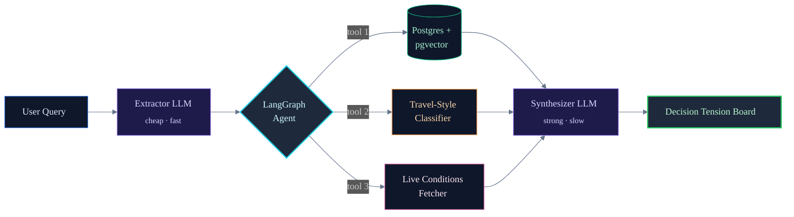

<div align="center">


</div>

<br/>

<div align="center">

[](https://www.linkedin.com/in/yasser-hamdan063/)
[](mailto:hamdanyasser2005@gmail.com)


</div>

<br/>

```
─────────────────────────────────────────────────────────────────────
  01 / WHO
─────────────────────────────────────────────────────────────────────
```

I work where most people see three separate things — **ERP / business systems**, **software engineering**, and **AI automation**. Currently a third-year Data Science student at the University of Sciences and Arts in Lebanon, graduating **June 2026**.

```yaml
identity:    Python & Odoo ERP Developer
focus:       Practical AI automation, ERP systems, full-stack delivery
shipped:     Auction module in Odoo 18 (Mobile Arts internship)
             10+ Plotly dashboards for renewable energy (XpertBot)
             6 personal projects across agents, NLP, and computer vision
languages:   Arabic (native) · English (professional) · French (intermediate)
seeking:     ERP/Odoo · Python · AI/ML — internship or new grad
```

<br/>

```
─────────────────────────────────────────────────────────────────────
  02 / NOW
─────────────────────────────────────────────────────────────────────
```

<table>
<tr>
<td valign="top" width="33%">

**🟢 &nbsp; Currently Building**

Polishing AtlasBrief for a public demo. Refactoring the LangGraph state machine so the agent's decision flow is observable from the UI.

</td>
<td valign="top" width="33%">

**🔵 &nbsp; Currently Reading**

*Designing Data-Intensive Applications* (Kleppmann). Plus the LangGraph release notes — they ship fast.

</td>
<td valign="top" width="33%">

**🟣 &nbsp; Currently Learning**

Production patterns for multi-agent systems. Cost optimization for two-model LLM routing at scale.

</td>
</tr>
</table>

<br/>

```
─────────────────────────────────────────────────────────────────────
  03 / WORK
─────────────────────────────────────────────────────────────────────
```

<table border="0">

<tr>
<td valign="top" width="50%">

### 🛒 &nbsp; Odoo Auction Module
*<sub>ERP · built at Mobile Arts internship</sub>*

> Custom Odoo 18 module: bid validation, proxy bidding, anti-sniping logic, Buy Now flow, payment tracking, security rules across three roles, QWeb templates, and analytics views. Sole developer, three-month build.

`Odoo 18` &nbsp; `Python` &nbsp; `PostgreSQL` &nbsp; `QWeb`

[**→ &nbsp; Source**](https://github.com/hamdanyasser/auction-system-odoo)

</td>
<td valign="top" width="50%">

### 🧠 &nbsp; AtlasBrief
*<sub>LangGraph travel-planning agent</sub>*

> Turns vague trip ideas into a defended itinerary. LangGraph orchestrating three Pydantic-validated tools, RAG over Postgres + pgvector, two-model LLM routing with per-request cost logging.

`Python` &nbsp; `LangGraph` &nbsp; `RAG` &nbsp; `FastAPI` &nbsp; `React`

[**→ &nbsp; Source**](https://github.com/hamdanyasser/atlasbrief-travel-agent)

</td>
</tr>

<tr>
<td valign="top" width="50%">

### 🏠 &nbsp; Atelier
*<sub>LLM + ML real-estate price estimator</sub>*

> Plain-English property descriptions become grounded price estimates. LLM extracts features into Pydantic-validated JSON, scikit-learn Random Forest predicts (**R² 0.90**), second LLM grounds the prediction against training-set statistics.

`Python` &nbsp; `scikit-learn` &nbsp; `OpenAI` &nbsp; `FastAPI` &nbsp; `React`

[**→ &nbsp; Source**](https://github.com/hamdanyasser/atelier-real-estate-estimator)

</td>
<td valign="top" width="50%">

### 🎯 &nbsp; Support Triage Cockpit
*<sub>RAG vs LLM benchmark · 10K tickets/hour</sub>*

> Compares RAG-grounded vs plain LLM replies, and a local LogReg classifier vs zero-shot LLM, on **20K support tickets**. Recommends what to ship based on accuracy, latency, and cost.

`Python` &nbsp; `Chroma` &nbsp; `scikit-learn` &nbsp; `FastAPI`

[**→ &nbsp; Source**](https://github.com/hamdanyasser/support-triage-cockpit)

</td>
</tr>

<tr>
<td valign="top" width="50%">

### 🐛 &nbsp; DebugMaster
*<sub>Gamified Android debugging tutor</sub>*

> Java + Firebase Android app. Learning paths, AI mentor support, XP and streaks, leaderboards, and live multiplayer debug battles with Firebase Realtime DB sync. MVVM + Hilt + Room.

`Java` &nbsp; `Android` &nbsp; `Firebase` &nbsp; `Room`

[**→ &nbsp; Source**](https://github.com/hamdanyasser/debugmaster-android)

</td>
<td valign="top" width="50%">

### 🧬 &nbsp; Biomedical NER
*<sub>BiLSTM-CRF · 87% F1 on BC5CDR</sub>*

> From-scratch named-entity recognition: BiLSTM-CRF with Viterbi decoding, character-level CNN, attention, and GloVe vectors. Ablation studies isolating contribution of each component. Live Gradio demo.

`PyTorch` &nbsp; `NLP` &nbsp; `Deep Learning` &nbsp; `Gradio`

[**→ &nbsp; Source**](https://github.com/hamdanyasser/NLP-NER-Project)

</td>
</tr>

</table>

<br/>

```
─────────────────────────────────────────────────────────────────────
  04 / SYSTEM
─────────────────────────────────────────────────────────────────────
```

<sup>How a request flows through AtlasBrief — my reference architecture for AI agent systems:</sup>



<details>
<summary><sub><b>↳ &nbsp;why two-model routing</b></sub></summary>

<br/>

A lightweight model handles structured extraction from the user query — cheap, fast, deterministic. A stronger model handles synthesis of the final defended itinerary, where reasoning quality matters. Per-request token logging shows the routing genuinely saves cost without measurable quality loss on extraction tasks.

</details>

<br/>

```
─────────────────────────────────────────────────────────────────────
  05 / STATS
─────────────────────────────────────────────────────────────────────
```

<div align="center">


&nbsp;


</div>

<br/>

```
─────────────────────────────────────────────────────────────────────
  06 / CERTIFICATIONS
─────────────────────────────────────────────────────────────────────
```

<table>
<tr>
<td valign="top" width="50%">

**🎓 &nbsp; IBM RAG and Agentic AI**
*<sub>Professional Certificate · 9 courses</sub>*

> RAG pipelines, vector databases, LangChain, LangGraph, CrewAI, AutoGen, BeeAI, MCP, multi-agent systems.

<sub>Issued Mar 2026</sub>

</td>
<td valign="top" width="50%">

**🤖 &nbsp; Anthropic — Claude Code in Action**
*<sub>Official Anthropic certification</sub>*

> AI-assisted development, tool chaining, context management, MCP integration.

<sub>Issued Nov 2025</sub>

</td>
</tr>
</table>

<br/>

```
─────────────────────────────────────────────────────────────────────
  07 / REACH ME
─────────────────────────────────────────────────────────────────────
```

<div align="center">

<br/>

**Open to ERP/Odoo, Python, and AI/ML engineer roles** <br/>
*Internship or new grad — starting June 2026*

<br/>

[](https://www.linkedin.com/in/yasser-hamdan063/)
&nbsp;
[](mailto:hamdanyasser2005@gmail.com)

<br/>

<sub>*— Yasser*</sub>

</div>
