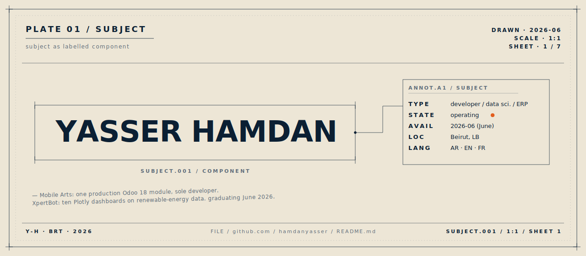
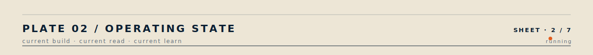
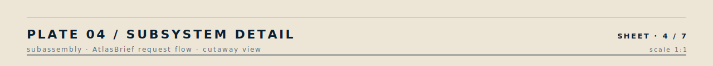
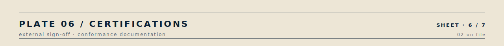
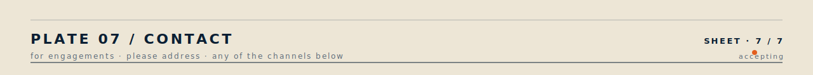

 

> *Subject is a Python and Odoo ERP developer with practical AI delivery experience.*  
> *Currently a third-year Data Science student at the University of Sciences and Arts in Lebanon (USAL), graduating June 2026.*  
> *Working at the seam where business systems meet AI agents — Odoo modules in production, LangGraph agents in development.*

 

 

 

| &nbsp; | &nbsp; |
|:---|:---|
| **`IN BUILD`** &nbsp; | Polishing **AtlasBrief** for a public demo. Refactoring the LangGraph state machine so every agent decision is observable from the UI. |
| **`IN REVIEW`** &nbsp; | *Designing Data-Intensive Applications* (Kleppmann). Plus the LangGraph release notes — they ship fast. |
| **`IN STUDY`** &nbsp; | Production patterns for multi-agent systems. Cost optimisation for two-model LLM routing at scale. |

 

↑ &nbsp; click any module label to open the underlying repository  ⋅  full index at <a href="https://github.com/hamdanyasser?tab=repositories">github.com/hamdanyasser</a>

 

> *Code shows what was built. Architecture shows how it was reasoned.*

↳ &nbsp; <code>NOTE.A1</code> &nbsp;—&nbsp; <i>why two-model routing</i>

 

A lightweight model handles structured extraction from the user query — cheap, fast, deterministic, Pydantic-validated at the boundary. A stronger model handles synthesis, where reasoning quality matters and latency is acceptable. Per-request token logging shows the routing genuinely saves cost without measurable quality loss on extraction. The agent's tool decisions are stateful and traceable end-to-end.

 

&nbsp;

 

<table>
<tr>
<td valign="top" width="50%">

**`CERT.001`** &nbsp;—&nbsp; **IBM — RAG and Agentic AI**
*Professional Certificate · 9 courses*

> RAG pipelines, vector databases, LangChain, LangGraph, CrewAI, AutoGen, BeeAI, MCP, multi-agent systems.

Issued Mar 2026  ⋅  external sign-off

</td>
<td valign="top" width="50%">

**`CERT.002`** &nbsp;—&nbsp; **Anthropic — Claude Code in Action**
*Official Anthropic certification*

> AI-assisted development, tool chaining, context management, MCP integration.

Issued Nov 2025  ⋅  external sign-off

</td>
</tr>
</table>

 

