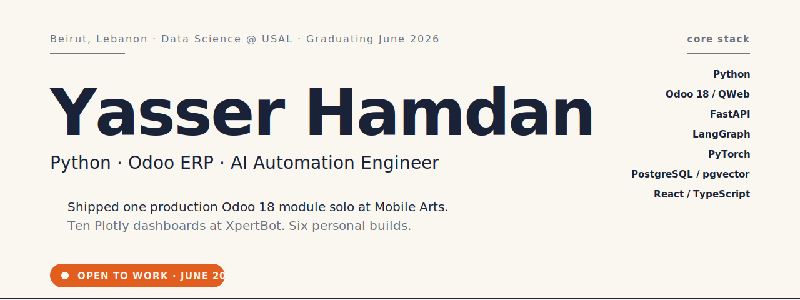

<picture>
  <source media="(max-width: 768px) and (prefers-color-scheme: dark)" srcset="./assets/hero-mobile-dark.svg">
  <source media="(max-width: 768px)" srcset="./assets/hero-mobile-light.svg">
  <source media="(prefers-color-scheme: dark)" srcset="./assets/hero-dark.svg">
  
</picture>

 
 

&nbsp;

&nbsp;

---

## About

Third-year Data Science student at **USAL** in Beirut, graduating **June 2026**. I work where business systems meet AI agents — building Odoo modules in production and LangGraph agents in development.

- **Mobile Arts internship** — shipped one production Odoo 18 auction module as sole developer
- **XpertBot internship** — built ten Plotly dashboards on renewable-energy data
- **Six personal projects** across agents, NLP, ML pipelines, deep learning, and Android

I'm available for ERP / Odoo, Python, and AI/ML engineer roles starting June 2026.

---

## What I'm doing right now

|  |  |
|:---|:---|
| 🟢 &nbsp; **Building** &nbsp; | **AtlasBrief** — refactoring the LangGraph state machine so agent decisions are observable from the UI |
| 🔵 &nbsp; **Reading** &nbsp; | **Designing Data-Intensive Applications** (Kleppmann) · LangGraph release notes |
| 🟠 &nbsp; **Studying** &nbsp; | Production patterns for multi-agent systems · cost optimization for two-model LLM routing |

---

## Featured projects

<table>

<tr>
<td width="50%" valign="top">

### 🤖 &nbsp; [AtlasBrief](https://github.com/hamdanyasser/atlasbrief-travel-agent)

LangGraph travel-planning agent. RAG over Postgres + pgvector. Three Pydantic-validated tools. Two-model LLM routing with per-request cost logging.

`Python` `LangGraph` `RAG` `FastAPI` `React`

**Status** — in service

</td>
<td width="50%" valign="top">

### 📊 &nbsp; [Atelier](https://github.com/hamdanyasser/atelier-real-estate-estimator)

Plain-English property descriptions → grounded prices. LLM extracts features, scikit-learn Random Forest predicts (R² 0.90), second LLM grounds against training stats.

`Python` `scikit-learn` `OpenAI` `FastAPI`

**Status** — shipped · R² 0.90 on Ames Housing

</td>
</tr>

<tr>
<td width="50%" valign="top">

### 🎫 &nbsp; [Triage Cockpit](https://github.com/hamdanyasser/support-triage-cockpit)

RAG-grounded vs. plain LLM. Local logistic regression vs. zero-shot. 20K tickets benchmarked. Recommends what to ship at 10K tickets/hour.

`Python` `Chroma` `scikit-learn` `FastAPI`

**Status** — benchmark complete · 20K tickets

</td>
<td width="50%" valign="top">

### 🧬 &nbsp; [Biomedical NER](https://github.com/hamdanyasser/NLP-NER-Project)

From-scratch NER on BC5CDR. BiLSTM-CRF + Viterbi decoding, character-CNN embeddings, attention, GloVe vectors. Ablation studies. Live Gradio demo.

`PyTorch` `NLP` `CRF` `Gradio`

**Status** — shipped · 87% F1

</td>
</tr>

<tr>
<td width="50%" valign="top">

### 🏷️ &nbsp; [Odoo Auction Module](https://github.com/hamdanyasser/auction-system-odoo)

Sole developer at Mobile Arts. Bid validation, proxy bidding, anti-sniping, Buy Now, payment tracking, security rules, QWeb templates.

`Odoo 18` `Python` `PostgreSQL` `QWeb`

**Status** — deployed · internship deliverable

</td>
<td width="50%" valign="top">

### 🐛 &nbsp; [DebugMaster](https://github.com/hamdanyasser/debugmaster-android)

Gamified Android debugging tutor. Learning paths, AI mentor support, XP/streaks, leaderboards, live multiplayer debug battles. MVVM + Hilt + Room.

`Java` `Android` `Firebase` `Room`

**Status** — shipped · educational

</td>
</tr>

</table>

---

## Stack

---

## Certifications

| | |
|:---|:---|
| 🎓 &nbsp; **IBM — RAG and Agentic AI** &nbsp; *(Mar 2026)* | Professional Certificate · 9 courses. RAG pipelines, vector databases, LangChain, LangGraph, CrewAI, AutoGen, BeeAI, MCP, multi-agent systems. |
| 🤖 &nbsp; **Anthropic — Claude Code in Action** &nbsp; *(Nov 2025)* | Official Anthropic certification. AI-assisted development, tool chaining, context management, MCP integration. |

---

## GitHub stats

&nbsp;

---

## Let's build something

Open to **ERP / Odoo · Python · AI/ML engineer** roles &nbsp;·&nbsp; starting June 2026

&nbsp;

Beirut, Lebanon &nbsp;·&nbsp; Arabic, English, French

